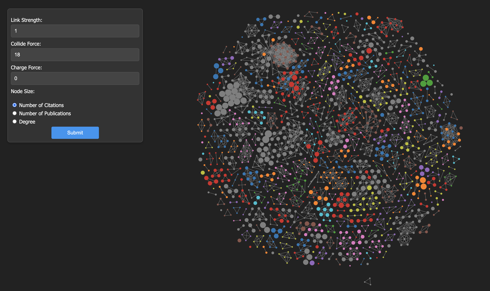

# Co-Authorship Network Visualization

## Overview

This project is an **interactive co-authorship network visualization** built using **D3.js**. It visualizes the relationships between authors and their collaborative works using a force-directed graph. The graph displays nodes representing authors, with links (edges) representing co-authorship connections between them. The interface allows users to adjust graph parameters (such as link strength, collide force, and charge force) and control the node size based on specific metrics, such as the number of citations, publications, or degree.



## Key Features

1. **Interactive Controls**: The graph includes controls for adjusting:
   - **Link Strength**: Controls the strength of the links between nodes (authors).
   - **Collide Force**: Manages how the nodes (authors) repel each other.
   - **Charge Force**: Determines the repelling or attracting force between the nodes.
   - **Node Size**: Based on the number of citations, number of publications, or degree of connectivity.
   
2. **Dynamic Graph**: The graph dynamically updates based on user-selected parameters, allowing for real-time visualization changes.

3. **Hover and Click Details**: Users can click on nodes (authors) to view detailed information such as the author’s name, title, country, and publication year.

## Technologies Used
- **D3.js**: For creating and handling the force-directed graph and rendering the nodes and edges dynamically.
- **HTML/CSS**: For structuring the page and styling the controls and visualization.
- **JSON/CSV Data**: The data for authors, publications, and co-authorship links are sourced from JSON and CSV files.

## Project Structure
```
├── index.html           # Main HTML file
├── script.js            # JavaScript to handle visualization and interaction
├── style.css            # CSS file for page styling
├── data/
│   ├── co_authorship_data.json  # Data file for co-authorship graph
│   ├── pub_network.json         # Publication data for the network
│   ├── data_scopus.csv          # Scopus dataset with additional publication details
└── Project_ScreenShot.png  # Screenshot of the project
```

## How It Works

1. **Graph Rendering**: 
   - **Nodes**: Represent individual authors.
   - **Edges (Links)**: Represent co-authorship between authors.
   - The graph uses a **force simulation** to position nodes based on their relationships, with customizable forces (link strength, collide force, and charge force).

2. **Data**: 
   - The project uses data from `co_authorship_data.json` to visualize authors and their collaborations. The node size can be adjusted based on the number of citations, publications, or the degree of connectivity of the authors.

3. **Interactivity**: 
   - Users can control parameters of the visualization (link strength, collide force, charge force) and update the graph based on their inputs. When nodes are clicked, additional information about the authors and their work is displayed in the side panel.

## Running the Project

### Prerequisites:
- A web browser (Chrome, Firefox, etc.) that supports JavaScript.
  
### Steps to Run:
1. Clone the repository:
   ```bash
   git clone https://github.com/jravikumar97/CoAuthor-Network-Vizualization
   cd co-authorship-network-visualization
   ```

2. Open the `index.html` file in your web browser to view the visualization.

## Usage
1. **Adjust the Forces**: Use the form on the left to change the link strength, collide force, and charge force, and then click "Submit" to update the graph.
   
2. **Change Node Size**: Select between the number of citations, number of publications, or degree to adjust the node size dynamically.

3. **View Author Details**: Click on a node (author) to see detailed information about the selected author, such as their name, title, country, and publication year.
